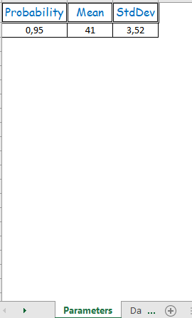
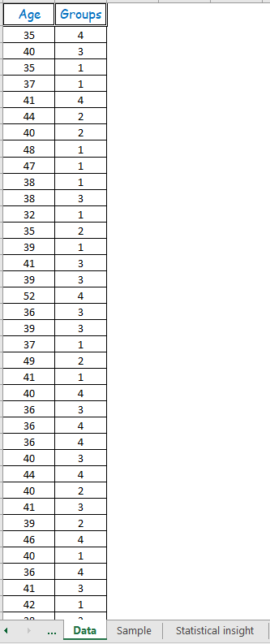
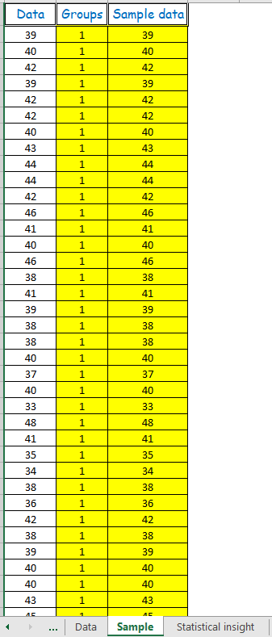
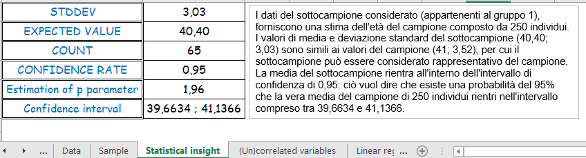
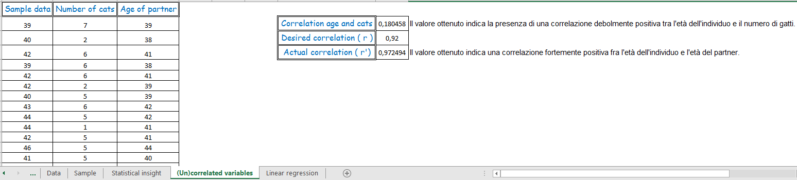
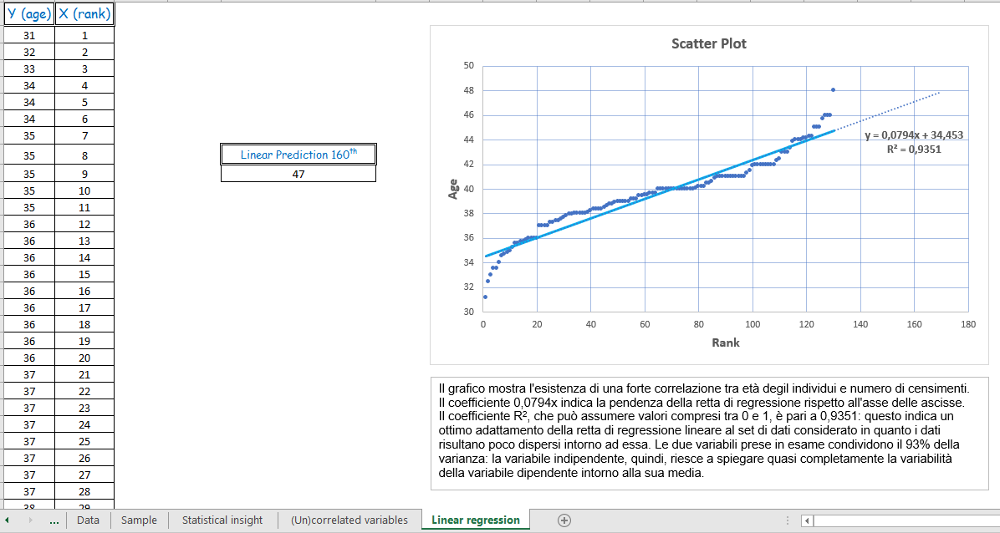

# Statistical Inference & Linear Regression Models

Questo progetto rappresenta il caso studio finale per il modulo di **Inferenza Statistica con Excel**, realizzato all'interno del mio percorso di **Master Professionale in Data Analytics certificato da ProfessionAI e Alteredu**.

## 🎯 Obiettivo del Progetto
Il progetto si focalizza sulla creazione e manipolazione di dati sintetici verosimili per simulare scenari reali di business. Attraverso l'analisi della popolazione immaginaria di "Luggnagg", l'obiettivo è consolidare le tecniche di analisi inferenziale, validazione di ipotesi e modellazione predittiva tramite regressione lineare, fornendo uno strumento robusto per decisioni basate sull'evidenza numerica.

## 🛠️ Metodologia e Analisi Statistica
Il workflow è suddiviso in sei fasi logiche, ognuna dedicata a un pilastro della statistica moderna:

### 1. Generazione del Dataset (Parameters & Data)
*   **Modellazione Stocastica:** Definizione di parametri di input (Media, Deviazione Standard, Probabilità) per generare una distribuzione normale accurata su un campione di 250 individui.
*   **Segmentazione:** Assegnazione casuale della popolazione a gruppi differenti per testare la variabilità campionaria.

### 2. Strategia di Campionamento (Sample)
*   **Campionamento Stratificato:** Estrazione di sotto-campioni specifici tramite logica condizionale, garantendo l'integrità del dato per le successive fasi inferenziali.

### 3. Analisi Inferenziale (Statistical Insight)
*   **Stima Parametrica:** Calcolo di indicatori chiave come Deviazione Standard, Valore Atteso e conteggi campionari.
*   **Intervalli di Confidenza:** Implementazione del calcolo del Confidence Interval e del Confidence Rate per determinare il grado di affidabilità delle stime rispetto alla popolazione totale.

### 4. Analisi delle Correlazioni ((Un)correlated Variables)
*   **Validazione delle Relazioni:** Test di correlazione tra le età del campione e variabili indipendenti (es. numero di animali domestici).
*   **Analisi Critica:** Interpretazione dei risultati per distinguere tra relazioni causali e correlazioni spurie.

### 5. Modellazione Predittiva (Linear Regression)
*   **Regressione Lineare Semplice:** Implementazione di un modello di previsione basato sulla relazione tra età (Y) e ordine di censimento (X).
*   **Data Visualization:** Creazione di uno Scatterplot con linea di tendenza e calcolo del coefficiente di determinazione ($R^2$) per valutare l'accuratezza del modello.

## 📊 Visualizzazione del Progetto

*Figura 1: Interfaccia per la definizione dei parametri della distribuzione normale.*

*Figura 2: Dataset generato di 250 individui con assegnazione stocastica ai gruppi.*

*Figura 3: Estrazione del sotto-campione tramite funzioni condizionali.*

*Figura 4: Calcolo degli intervalli di confidenza e analisi inferenziale dettagliata.*

*Figura 5: Analisi della correlazione tra variabili del dataset.*

*Figura 6: Regressione lineare semplice con Scatterplot per l'analisi predittiva.*

## 📈 Valore Aziendale del Progetto
*   **Simulazione di Scenari:** Fornisce un ambiente sicuro per testare ipotesi di mercato e modelli di Machine Learning su dati verosimili.
*   **Riduzione dell'Incertezza:** L'uso di intervalli di confidenza permette di quantificare il rischio associato alle stime campionarie.
*   **Cultura Data-Driven:** Dimostra la capacità di interpretare dati complessi e trasformarli in insight azionabili per la formazione e la strategia aziendale.

---
**Formazione:** Progetto certificato da **ProfessionAI** e **Alteredu**.
**Autore:** [Massimiliano Izzo](https://linkedin.com/in/massimilianoizzo) – BI & Data Storytelling Specialist
